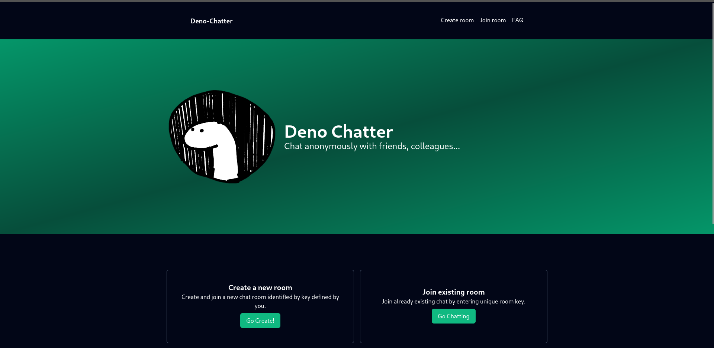

# deno-chatter

real time chat application written in `Typescript`, `Deno` and `WebSocket API`. You can create a new chat room or join already existing one without the need of any registration. Everything is happening on the server and no database is used to store any data at all.

## How it works?

It's simple, you chose your username and then chose if you wanna:

- create a new room
  - select "Create a new room" box by the green button
  - type the unique room key and your username
  - click the submit button and you should be connected
  - once the room is empty, it will be automatically deleted. But the code can be reused later.
- join existing room
  - select "join existing room" box by the green button
  - enter your username and room key
  - submit by hitting the green button
  - you should be redirected and hopefully connect to the desired room
